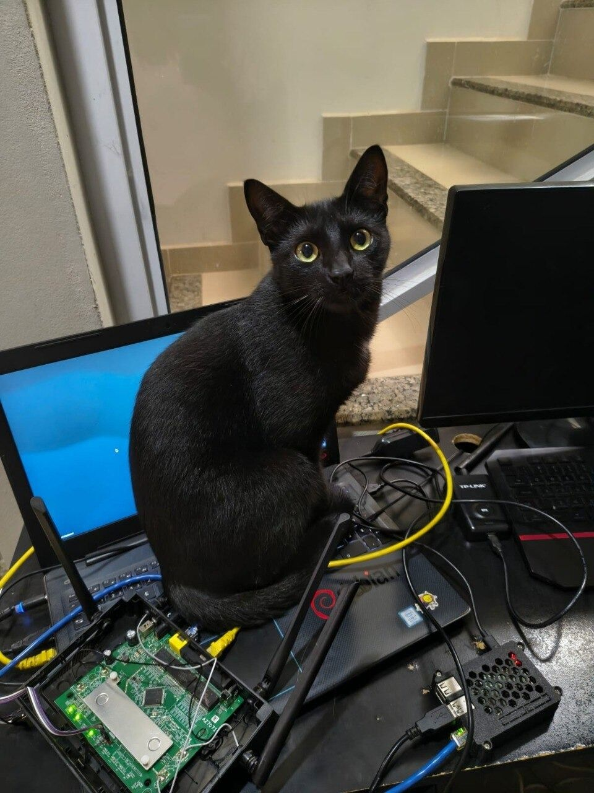

# openwrt-dlink-dir842-r1

<p align="center"></p>

Mainline-style OpenWrt for the **D-Link DIR-842 rev R1** (RealTek **RTL8197F** SoC).
This repo is a **build recipe**: `build.sh` overlays `./files/` onto a pinned
[ggbruno/openwrt](https://github.com/ggbruno/openwrt) checkout and produces both a
RAM-boot image and a NOR flash image.

Headline: **hardware NAT offload at gigabit line rate on mainline OpenWrt** —
**891 Mbit up / 896 Mbit down with 0.0 % of payload bytes crossing the CPU** and the
CPU ~99.7 % idle. As far as we know this is the first working mainline OpenWrt
`rtl865x` ASIC L3/L4 offload. Stock D-Link on the same bench measures 913/923.

> ## ⚠️ Read this before flashing
>
> **This is for the DIR-842 rev R1 (RTL8197F) only.** Do not try it on other DIR-842
> revisions or other devices.
>
> **Flashing REPLACES the stock firmware.** The NOR image boots from flash and survives
> a power cycle, so it does not go away on its own.
>
> - **Back up all 8 MB of NOR first, and keep that backup off the router.** It is the
>   only restore source guaranteed to be correct for *your* unit. **Making the backup
>   needs a root shell on stock, which means a serial console** — see
>   [`docs/RESTORE-STOCK.md`](docs/RESTORE-STOCK.md). Official D-Link firmware for this
>   exact revision may or may not be downloadable in your region, so do not count on it.
> - **Installing does not need serial** — you can flash over the network through
>   D-Link's own web UI (see *Installing*). **Recovering a bad flash does**: the
>   RealTek loader (TFTP/XMODEM) is the safety net, and it needs a 3.3 V UART on the
>   board's header. Decide up front whether you are willing to open the case if it
>   comes to that.
>
> **The safest way to try this is the initramfs image**, which is loaded into RAM and
> **never writes flash** — a power-cycle discards it entirely.
>
> **Fix these three things before this touches a real network:**
>
> - **BOTH APs are OPEN** — 5 GHz **`DIR842-OpenWrt`** and 2.4 GHz **`DIR842-2G`**, each
>   `encryption='none'`. A default image broadcasts two unencrypted networks. (Open on
>   purpose: a PSK baked into a published image would be a published credential.)
> - **There is no root password.** Set one (`passwd`) — with open APs, anyone in range
>   can log in.
> - **The regulatory domain is hard-coded to `BR`** (Brazil), because that is where the
>   port was developed and it unlocks the UNII-1 channels used for the default channel 36.
>   Set yours: `uci set wireless.radio0.country='<your ISO code>'; uci commit wireless; wifi`.
>   (The 2.4 GHz radio's `country` is a separate, *numeric* vendor MIB — see
>   `docs/WIFI-DUAL-BAND.md` §9 before touching it.)
>
> Defaults live in `files/…/uci-defaults/99-dir842-m5` (5 GHz) and
> `files/…/uci-defaults/09_wireless-dualband-dir842` (2.4 GHz).

## The hardware

| | |
|---|---|
|  | **Is yours an R1? Check the bottom label** — this port needs **`H/W Ver.: R1`** (P/N `YIR842ZBR…R1E`, an Anatel-certified Brazilian unit; the stock build identifies as D-Link Russia). Other DIR-842 revisions are entirely different SoCs. *(Unit identifiers redacted in this photo.)* |
|  | **Rear**: 4 gigabit LAN jacks + the yellow gigabit WAN jack — all five behind the external **RTL8367S** switch on a single RGMII trunk, which is what makes the [hardware NAT offload](docs/HWNAT-OFFLOAD.md) story interesting. Four external antennas: 2×2 per band. |
|  | **Inside** (board `AZ707I`): the **RTL8197F** SoC sits under the metal shield plate; 64 MB DRAM, 8 MB SPI-NOR (W25Q64), the **RTL8822BE** for 5 GHz, and the four antenna pigtails. Serial recovery is **38400 8N1** on the board's UART — ⚠ the header's exact location/pinout was never formally mapped in this project ([`docs/BENCH.md`](docs/BENCH.md) §"unknowns"), so identify VCC/GND/TX/RX with a multimeter before wiring. |

## Status

**Works**

- **Boots** mainline OpenWrt (kernel 4.14) from NOR, unattended, surviving power cycles.
- **Wired ethernet** — a carved RTL8197F NIC driver (`rtl819x`) drives the CPU-port DMA.
- **Managed switch, WAN/LAN split** — the external 5-port **RTL8367S** in the vendor's
  **CPU-tag / port0-router** mode, so the five jacks appear to the SoC as its own ports
  0–4 with the CPU on port 8 (`eth0.1` = WAN, `eth0.2` = LAN).
- **Router with NAT**, fw3, software flowtable fastpath, PPPoE.
- **Hardware NAT offload** — the RTL8197F switch core's L3/L4 engine routes *and*
  source-NATs entirely in silicon. Linux conntrack installs per-flow NAPT rows into the
  ASIC via `ndo_flow_offload`. Measured on a two-port gigabit bench:

  | | throughput | payload bytes through CPU | CPU busy |
  |---|---|---|---|
  | offload off | 184 up / 187 down Mbit | ~100.6 % | ~52 % |
  | **offload on** | **891 up / 896 down Mbit** | **0.0 %** | **0.3 %** |

  **Armed automatically at boot** by the `dir842-asic` service (last step, after the ASIC
  warm-up); runtime toggle: `echo 0/1 > /sys/module/rtl819x/parameters/hwnat`.
- **5 GHz WiFi** — on-board **RTL8822BE** (PCIe) via **rtw88**, AP mode (⚠ the
  shipped config is **open** — see the warning above; WPA2 itself works). RTL8197F +
  PCIe WiFi had never worked in OpenWrt before (see *Engineering notes*).
- **Web UI** — LuCI over uhttpd on `http://192.168.0.1`, for WAN/PPPoE, Wi-Fi, firewall.
  (ℹ LuCI's status panel for the **2.4 GHz** radio shows dashes/0 dBm — cosmetic: the
  vendor driver has no nl80211, so iwinfo can't read it. The AP still works; client
  list lives in `/proc/wlan0/sta_info`. See `docs/WIFI-DUAL-BAND.md` §8.)

- **2.4 GHz WiFi** — the on-SoC WMAC via the vendor `rtl8192cd` driver (WEXT, in-kernel
  WPA2-PSK). Both radios run concurrently, bridged into `br-lan` (⚠ **both ship open** —
  set keys before this touches a real network). The driver source ships in `files/` —
  see *Building* for the licensing story.
- **802.11r (fast BSS transition) on BOTH radios** — new in v1.1. The 5 GHz side gets it
  from hostapd as usual; the 2.4 GHz side is the interesting one, because the vendor
  driver implements FT itself and it had simply never been compiled in. Verified on air
  with two independent clients and real roams in both directions, including against a
  hostapd AP (`FT: Completed successfully`). Opt-in per BSS — see
  [`docs/WIFI-DUAL-BAND.md`](docs/WIFI-DUAL-BAND.md#10-80211r-fast-transition-on-both-radios).
- **A boot-time WiFi datapath fix** — `asic-wifi-settle` (new in v1.1). On a cold boot
  the S97 ASIC pass completes before the wireless side has settled and leaves the
  *wireless* datapath dead: both radios beacon at full strength, `wlan0` sits in the
  bridge "forwarding", and **no client can associate or DHCP**, while the wired path
  looks perfectly healthy from SSH. The shim re-runs the (idempotent) bring-up once the
  radios are up. Cost: WiFi does not pass traffic for roughly the first minute after boot.
- **Role-aware ASIC bring-up, and a dumb-AP/bridge deployment that actually works** (new
  in v1.1). Router vs. bridge role now auto-detects (`network.wan` present or not;
  overridable via `uci set dir842.asic.role=...`), and the router-only hardware
  acceleration steps — `fabric_reset`, `gw_prog`, `hwnat` — are skipped entirely on a
  bridge. This closes a real bug: on the unconditional pre-v1.1 sequence, `gw_prog`
  freezes L2/ARP aging, which on a bridge silently and *permanently* blackholed any
  wireless client that roamed in from another AP on the same LAN — no DHCP, no ARP, wired
  path unaffected. That mechanism caused two real house-wide outages while this port ran
  as a home dumb-AP during development. Root-caused, fixed (role gating + a new
  `/proc/rtl865x_l2flush` interface + poller that actively invalidates a roaming
  station's stale row), and re-verified live against the actual trigger that caused the
  first outage: 0% packet loss over a 610-second monitored trial with a hardware
  kill-switch armed. Full story: [`docs/SWITCH-AND-DATAPATH.md`](docs/SWITCH-AND-DATAPATH.md) §10.

**Known limitations**

- **Pre-production.** Everything above is measured on an isolated bench (one host on a
  LAN jack, one Pi on the WAN jack), not from months of running someone's house. It
  routes, but treat it as pre-production and keep your backup.
- **WAN ships as a DHCP client.** If your ISP needs PPPoE (or a static address), set it in
  LuCI — *Network → Interfaces → WAN*. Hardware offload follows a dynamic address: the
  ASIC's masquerade IP is reprogrammed from the live WAN IP per flow.
- **Blank WiFi efuse** — this board keeps no RTL8822BE calibration on-chip, so TX power
  is uncalibrated (works, but not "loud"); handled in software (default RFE + pinned MAC).
- **Download throughput is variable** (**681–906 Mbit** across runs) with 1200–2500 TCP retransmits per
  10 s run. The router is not the bottleneck (CPU 0.3 %, zero interface errors), but the
  loss source is not yet identified. Take a range, not a single run.
- The ASIC's inbound NAPT row is **full-cone**: a masquerade source-port collision
  between an offloaded and a software flow can misdeliver packets. A NAPT miss always
  traps to the CPU, so software forwarding is the safe fallback — but note the shipped
  images **arm offload at boot**, so if you want the software path you must disarm it
  (`echo 0 > /sys/module/rtl819x/parameters/hwnat`, or `/etc/init.d/dir842-asic stop`).
- ~~After a WAN interface bounce, offload drops to the software path~~ — **fixed.**
  Root cause: `ifdown wan` destroys `eth0.1`, and an ASIC reprogram in that window fell
  back to a constant WAN-interface MAC; reverse-direction frames then missed
  classification and ran on the CPU (~500 Mbit) until a manual reprogram. The driver now
  keeps a last-known-good interface MAC and additionally resyncs the ASIC's WAN netif
  against the live netdev on every flow offload. Verified: `ifdown/ifup` (quick and
  30 s), a reprogram during the down-window, and a full `/etc/init.d/network restart` all
  come back at ~895 Mbit offloaded with no manual step. (The persistent *stall* that used
  to live here — ["A-2" / issue #1](https://github.com/ADCDS/openwrt-dlink-dir842-r1/issues/1),
  offloaded bulk TCP dying while ICMP passed — was a stale connected-route ARP binding,
  also fixed.)
- `rtl819x: recovery level 3` fires ~2× per boot. Pre-existing, benign, unexplained.

## Building

**You do not need to build to install.** Prebuilt, signed images are attached to the
[latest release](https://github.com/ADCDS/openwrt-dlink-dir842-r1/releases/latest) —
download those and skip to *Installing*. Build only if you want to change something or
verify the images yourself.

```bash
git clone https://github.com/ADCDS/openwrt-dlink-dir842-r1
cd openwrt-dlink-dir842-r1
./build.sh
```

Output in `openwrt/bin/targets/realtek/rtl8197f/`:

| image | what it does |
|---|---|
| `*-initramfs-kernel.bin` | XMODEM into RAM over serial. **Never writes flash.** Start here. |
| `*-squashfs-factory.bin` | NOR flash via the loader's `AUTOBURN`. **Replaces stock.** |
| `*-squashfs-sysupgrade.bin` | NOR flash via `sysupgrade`. **Replaces stock.** |

**2.4 GHz: the vendor `rtl8192cd` driver source ships in this repo** (~1,100 files
under `files/…/drivers/net/wireless/rtl8192cd/` plus ~37 `include/net/rtl/*`
headers), so the images build with both radios. On the licensing: an earlier
revision withheld these files on the belief that they carried no license grant.
A file-by-file audit corrected that — the core driver and the `phydm` RF code
(336 of the ~650 C/H files, including `8192cd.h` itself) carry **explicit GPLv2
grant headers**, the module declares `MODULE_LICENSE("GPL")`, the Realtek SDK
that vendors distribute it in is published under a top-level GPLv2 `LICENSE`,
and the driver links into the GPL kernel — the same basis on which this code has
shipped in router GPL source releases for a decade. The remainder (`WlanHAL/`,
the headers) carries Realtek copyright notices without an explicit grant; those
notices are preserved intact, and `WlanHAL/Data/8197F/rtl8197Ffw.bin` is the
WMAC's chip firmware. If Realtek objects, the deletion is one directory.
`g3-rtl8192cd-4.14-port.patch` / `g4-rtl-headers-4.14-port.patch` in the repo
root remain as the historical record of the 4.14 port (the shipped tree already
contains everything they describe).

**Build environment:** the ggbruno fork is from 2020 (kernel 4.14 / gcc 8.4). Build on a
**Debian 11 (bullseye)-era** host or container; very new toolchains fail the old host
tools.

A working container is committed at [`Dockerfile`](Dockerfile) — a non-root `builder`
user (OpenWrt refuses to build as root), `python2`, and the full host-tool list:

```bash
docker build -t owrt-dir842 .
docker run --rm -v "$PWD":/build -w /build owrt-dir842 ./build.sh
```

Use it rather than a one-liner; earlier revisions of this README shipped a
`debian:bullseye` one-liner that ran as root with `python3` only and does not complete a
build. Details and the two traps (workdir, uid) are in
[`docs/BENCH.md`](docs/BENCH.md) §7.

## Installing

### Over the air, via the stock web UI (easiest — no serial cable)

You can install this port on a stock unit **entirely over the network**: log into D-Link's
own admin page, go to **System → Firmware Update → Local Update**, and upload
`…-squashfs-factory.bin` — the same way you'd apply an official D-Link update. Stock writes
it and reboots into OpenWrt at `192.168.0.1`. No UART, no soldering, no exploit; the
factory image is already loader-signed, so there's no signing step. Reverting to stock is a
single `mtd write` over SSH. This is verified end-to-end on the hardware.

**Full step-by-step (both directions):** [docs/OTA-INSTALL.md](docs/OTA-INSTALL.md).

The serial methods below still work and are the recovery route if a flash ever goes wrong.

**Serial console is 38400 8N1** — the D-Link documentation's 115200 is wrong and gives
you garbage.

### RAM-boot (safe, no flash writes)

1. Power on and spam `ESC` to catch the RealTek loader → `<RealTek>` prompt. ★ There is
   exactly **one ~1-second window per power-cycle**, and it opens immediately at
   power-on — start spamming *before* you apply power, not after.
2. Load the initramfs image, either:
   - **over the network (fast, ~seconds):** `IPCONFIG 192.168.0.1` (⚠ this sets the
     *loader's* own address — its nvram default is `192.168.1.6`, so without this step the
     upload below silently goes nowhere), then `AUTOBURN 0`, `LOADADDR 81000000`, `TFTP +`,
     then from your PC (on `192.168.0.2/24`)
     `curl -T initramfs.bin tftp://192.168.0.1/img`
   - **over serial (~18 min at 38400):** `XMOD 81000000` — bare hex, **no `0x` prefix**,
     which the loader rejects — then send the file with XMODEM (`sx -v img > /dev/ttyUSB0 < /dev/ttyUSB0`).
3. `J 81000000` to jump. A power-cycle discards it and returns you to whatever is in flash.

Full loader reference, including the exact automation used on the bench:
[`docs/BENCH.md`](docs/BENCH.md) §8.

### NOR flash (replaces stock — back up first)

The loader verifies a D-Link trailer before it will boot an image from flash. It is a
**forgeable keyed-MD5**, so a self-built image can be made bootable:

```
[cvimg image][ MD5(key || cvimg_image) : 16 ][ 00 C0 FF EE : 4 ]
```

with the key embedded in the bootcode. ⚠ The offset `0x291bc` is into the
**decompressed** bootcode, not into a raw `mtd0` dump (that offset in a raw dump reads
`0xff`) — the bootcode is a gzip stream starting at `mtd0+0x7d70`; see
[`docs/BENCH.md`](docs/BENCH.md) §"boot key".

**Images built by `build.sh` — and the prebuilt release images — already carry this
trailer** (the build runs `dlink-md5-sign`), so flash them as-is; there is no signing
step. `tools/sign-dlink.py` implements the format for rebuilders and for signing images
that do not already carry a trailer:

```bash
tools/sign-dlink.py unsigned.bin signed.bin
```

To flash from the loader: put your PC on `192.168.0.2/24`, then at the `<RealTek>`
prompt `IPCONFIG 192.168.0.1` (sets the *loader's* address), `AUTOBURN 1`, `TFTP +`
(the **loader** is the TFTP server), then push from the PC with
`curl -T factory.bin tftp://192.168.0.1/img` and wait for `Flash Write Successed`
before removing power.

This is published because it is what makes the port usable at all — it is a boot-time
integrity check on a device you own, not a content-protection or anti-tamper measure,
and without it the flash path cannot be reproduced by anyone else.

### Going back to stock (fully reversible)

Installing OpenWrt overwrites **only** the firmware region — your unit's bootloader, MAC
address, and RF calibration live in separate flash partitions that no install step
touches — so you can return to a pristine D-Link firmware at any time, and back to OpenWrt
again, as often as you like — **provided you have a stock image to restore from** (your
own backup, or official D-Link firmware for this exact revision if you can obtain it).
The restore is verified on hardware in both directions; from a running OpenWrt it is a
single `mtd write - firmware` (the same operation stock's own updater performs). Full
instructions, including how to obtain a stock image (this repo does **not** redistribute
it) and the serial-console recovery route:
**[docs/RESTORE-STOCK.md](docs/RESTORE-STOCK.md)**. For the whole round trip in one place —
install over the air *and* revert — see **[docs/OTA-INSTALL.md](docs/OTA-INSTALL.md)**.

## Engineering notes

- **PCIe / RTL8822BE bring-up.** The stock loader trains the PCIe link but OpenWrt's
  `pci-realtek` did not — a wall the RTL8197F community had abandoned (e.g. the Netis
  N2 port). Reversing the stock kernel showed mainline pointed two writes at the wrong
  registers: the **PHY digital-reset release must go to `0xb8000100`** (not
  `0xb8000050`), and the **device reset is `0xb8000050` bit 1: clear → 300 ms → set**
  (not a no-op CLKMANAGE toggle). Link now trains cold, `10ec:b822` enumerates, rtw88
  binds. Crystal is **25 MHz** (from the SoC bootstrap register), not 40.
- **Hardware NAT offload.** `rtl865x_asichal.c` is a clean re-implementation of the
  ASIC table engine (netif / route / nexthop / ARP / L2 / NAPT / extIP), reverse
  engineered from the stock 3.10 kernel and cross-checked against the vendor SDK;
  `rtl819x_hwnat.c` wires it to conntrack. Forwarding chain is
  `route(process=5) → nexthop → ARP → L2`.
  - ★ **The RTL8197F keys and hashes NAPT on NUMERIC (host-order) values, not on the
    on-wire network order.** The vendor's `htonl()` at the ASIC boundary is `ntohl()`
    in disguise, because its fields are raw `__be32` straight from conntrack. Key,
    index, G encoding and the inbound verification hash must *all* be numeric
    **together** — any one left swapped hides the win completely.
  - ★ **CPU-tag mode is what makes offload possible.** With all five jacks hidden behind
    the single RGMII trunk, a routed unicast has no distinct egress port to commit to,
    so the ASIC traps every packet to the CPU no matter how well the NAPT rows match.
- **`CPUICR1` bit 1 `CF_NIC_LITTLE_ENDIAN` must be programmed explicitly.** The
  bootloader only sets it when it runs its own network init, so a TFTP RAM boot works
  (`0x82`) while a NOR flash boot does not (`0x80`) — and with it clear the NIC DMAs
  every frame into DRAM 32-bit-word byte-swapped, so `eth_type_trans()` reads a
  "multicast" destination MAC and frames are counted but never reach the IP stack.
  Fingerprint: `eth0.2` `rx_packets` and `rx_multicast` rising 1:1 while `br-lan` stays
  flat.
- **The two radios collide over interface naming.** `mac80211` derives its name from the
  phy index (`phy0` → `wlan0`), but the vendor `rtl8192cd` driver creates a real netdev
  called `wlan0` at module load. `10_wireless-5g-ifname-dir842` pins the mac80211 side
  to `wlan1`. Do not rely on module load order to keep them apart.

More detail in [`docs/`](docs/).

## Credits & license

Built on [ggbruno/openwrt](https://github.com/ggbruno/openwrt) (RTL8197F target) and
hackpascal's `pci-realtek` driver.

**GPL-2.0** ([`LICENSE`](LICENSE)), following OpenWrt. The `net80211` headers under
`files/` are BSD-licensed and carry their original notices. The vendor `rtl8192cd`
driver under `files/` is redistributed on the GPLv2 basis described in *Building*,
with all Realtek copyright notices preserved. D-Link stock firmware is **not**
redistributed here.

## Bench QA

<p align="center"></p>

Bituca performing on-site thermal validation. Verdict: the notebook under gigabit NAT
load makes an excellent heated cat bed — 891 Mbit/s up, 896 down, purring throughout.
