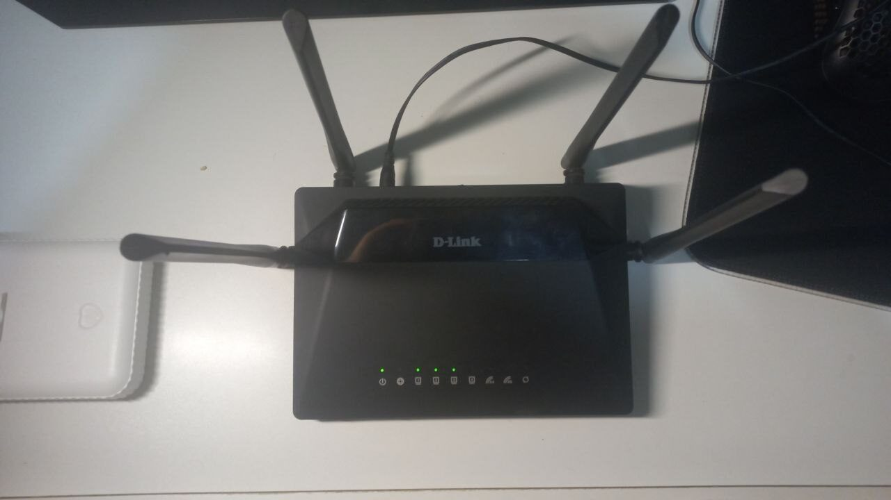
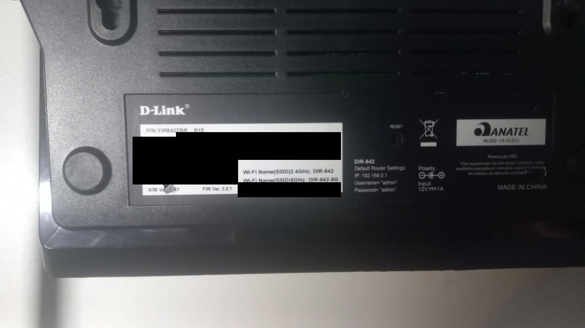
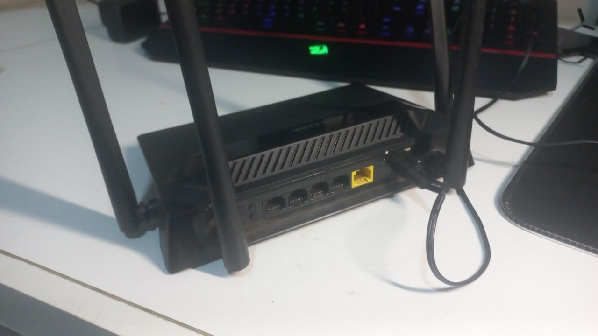
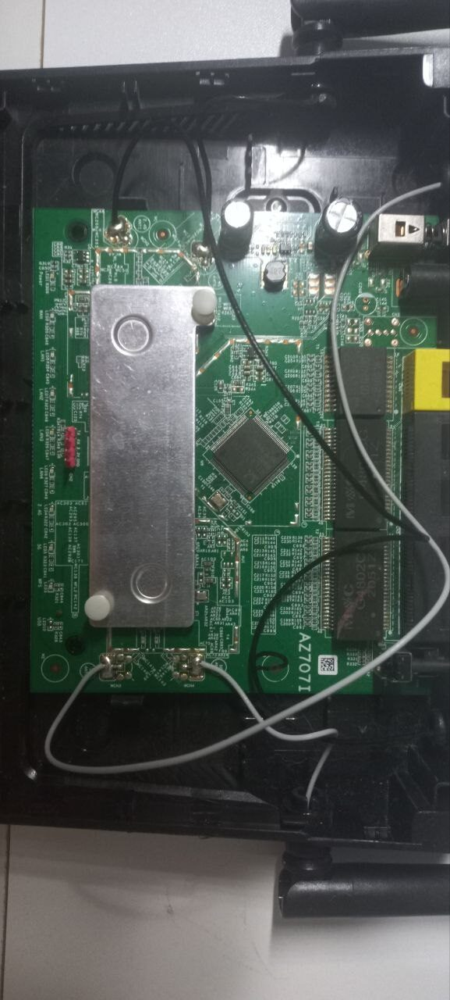

# openwrt-dlink-dir842-r1

<p align="center"></p>

Mainline OpenWrt for the **D-Link DIR-842 rev R1** (RealTek **RTL8197F** SoC).
This repo is a **build recipe**: `build.sh` clones `openwrt/openwrt` at a pinned commit,
overlays `./files/` (the `rtl819x` target plus a handful of generic additions), and
produces both a RAM-boot image and a NOR flash image.

**Branch status: `port/main-6.18` is a rebase in progress, not a finished release.**
Kernel 6.18 on OpenWrt main, the RTL8367S switch on mainline DSA instead of swconfig, wired
ethernet, a 5 GHz AP, and the on-SoC 2.4 GHz vendor radio all work — both radios run
simultaneously, clients associate and get DHCP over either one — and the router forwards
LAN↔WAN traffic reliably in software (a real root-cause fix landed 2026-09-04); true
zero-CPU ASIC hardware acceleration is the one piece not there yet. See *Status* below
for exactly what that means, and
[`docs/PORT-MAIN-6.18-STATUS.md`](docs/PORT-MAIN-6.18-STATUS.md) for the full engineering
account. If you want the finished, dual-band, hardware-NAT-at-gigabit product this repo
used to describe, that is the `main` branch (kernel 4.14) — still supported, still the one
to flash today if you want everything working.

> ## ⚠️ Read this before flashing
>
> **This is for the DIR-842 rev R1 (RTL8197F) only.** Do not try it on other DIR-842
> revisions or other devices.
>
> **Flashing REPLACES the stock firmware.** The NOR image boots from flash and survives
> a power cycle, so it does not go away on its own.
>
> - **Back up all 8 MB of NOR first, and keep that backup off the router.** It is the
>   only restore source guaranteed to be correct for *your* unit. **Making the backup
>   needs a root shell on stock, which means a serial console** — see
>   [`docs/RESTORE-STOCK.md`](docs/RESTORE-STOCK.md). Official D-Link firmware for this
>   exact revision may or may not be downloadable in your region, so do not count on it.
> - **Installing does not need serial** — you can flash over the network through
>   D-Link's own web UI (see *Installing*). **Recovering a bad flash does**: the
>   RealTek loader (TFTP/XMODEM) is the safety net, and it needs a 3.3 V UART on the
>   board's header. Decide up front whether you are willing to open the case if it
>   comes to that.
>
> **The safest way to try this is the initramfs image**, which is loaded into RAM and
> **never writes flash** — a power-cycle discards it entirely.
>
> Fix these before this touches a real network:
>
> - **The 5 GHz radio ships disabled, with no SSID or key baked in.** There is nothing to
>   turn off — the default image genuinely broadcasts nothing until you configure and
>   enable it. Do that with a real passphrase before you rely on it.
> - **There is no root password.** Set one (`passwd`) before exposing SSH to anything you
>   do not control.
> - **The 5 GHz regulatory domain defaults to unset.** Set yours before enabling the
>   radio: `uci set wireless.radio0.country='<your ISO code>'; uci commit wireless; wifi`.

## The hardware

| | |
|---|---|
|  | **Is yours an R1? Check the bottom label** — this port needs **`H/W Ver.: R1`** (P/N `YIR842ZBR…R1E`, an Anatel-certified Brazilian unit; the stock build identifies as D-Link Russia). Other DIR-842 revisions are entirely different SoCs. *(Unit identifiers redacted in this photo.)* |
|  | **Rear**: 4 gigabit LAN jacks + the yellow gigabit WAN jack, all five behind the external **RTL8367S** switch — now driven by mainline DSA as real per-jack switch ports rather than a cascaded trunk. Four external antennas: 2×2 per band. |
|  | **Inside** (board `AZ707I`): the **RTL8197F** SoC sits under the metal shield plate; 64 MB DRAM, 8 MB SPI-NOR (W25Q64), the **RTL8822BE** for 5 GHz, and the four antenna pigtails. Serial console is **38400 8N1** on the board's UART. |

## Status

Milestone table and the full account (what was verified on hardware, what is still open,
and the exact register-level evidence for the hardware-NAT gap): see
[`docs/PORT-MAIN-6.18-STATUS.md`](docs/PORT-MAIN-6.18-STATUS.md).

**Works, verified on hardware:**

- **Boots from NOR unattended, survives power cycles and `sysupgrade`.** 10 consecutive
  cold boots, no oops or panic, jffs2 overlay every time.
- **Wired ethernet + switch.** The RTL8367S over mainline `rtl8365mb`/DSA, real per-jack
  ports (`lan1`–`lan4`, `wan`) instead of the old VLAN-cascade trunk model. Router with
  NAT, firewall4, PPPoE, forwarding reliably via the software fastpath. Verified with
  rate-capped `iperf3` through the box: clean, complete, **zero-retransmit** transfers at
  every rate up to ~130 Mbit/s with the CPU 90% idle — at or above what this class of home
  router's uplink ever sees. (Only an unpaced same-speed line-rate blast, which exceeds the
  ~150 Mbit/s software-forwarding CPU ceiling, collapses — that ceiling is exactly what true
  ASIC hardware acceleration would remove; see the next bullet.)
- **5 GHz WiFi.** On-board **RTL8822BE** (PCIe) via **rtw88**, AP mode, HT20. PCIe link
  training and the radio's blank-efuse quirk both carried forward from the 4.14 port's
  fixes. A boot-time PCIe-probe race that could occasionally leave the radio down is now
  auto-recovered by a new `asic-wifi-settle` service, verified live on a cold boot. A
  client actually associating and completing DHCP has not been exercised on this
  bench — the beacon itself was confirmed by an independent client.
- **Hardware NAT — forwards reliably in software, ASIC acceleration still open.** The
  offload path was rebuilt on the kernel's current interface (`ndo_setup_tc(TC_SETUP_FT)` +
  tc-flower, replacing the downstream API the old driver used). The root cause of a
  session-long bulk-transfer-stall bug was found and fixed: `flow_offloading_hw=1`
  (mainline `nf_flow_table`'s hardware-offload flag) forces a MAC-caching transmit mode
  that silently drops reverse-NAT traffic on this board's asymmetric bridge/DSA topology —
  now shipped off by default, with plain software flow offload (`flow_offloading=1`) doing
  the accelerating instead. Two ASIC-driver bugs were also found and fixed along the way.
  True zero-CPU ASIC hardware acceleration (what the `main` branch's 4.14 product achieves,
  ~889-896 Mbit/s at 0% CPU) is not reached yet — the software fastpath tops out around
  ~150 Mbit/s. A live experiment (2026-09-04) narrowed the remaining gap considerably:
  restricting the offload flowtable to the WAN device confirmed that the reverse-NAT
  drop is fixable and engages real ASIC offload, leaving one isolated blocker — a
  forward-path tail-drop on the SoC's own port-0 queue under line-rate offload. This is a
  real, narrow, evidence-backed remaining question with a documented next step, not a
  wiring gap; see the status doc §4.
- **2.4 GHz WiFi.** The vendor `rtl8192cd` driver (the thing that makes the `main` branch
  dual-band) is fully working end to end: it compiles and links clean, loads on real
  hardware, beacons an AP, and — after finding and fixing a whole class of timer-callback
  ABI bugs left by the 4.14→6.18 port — a real client associates, gets DHCP, and passes
  traffic (22.6 Mbit/s iperf3, 0 retransmits) simultaneously with the 5 GHz radio, with zero
  OOM kills. Long-run stability, the last open question, is now answered: re-checked
  2026-09-04 with no prior setup, the box was found already at 3h20m continuous uptime with
  both radios still up and no crash. Shipped in the release `seed.config`.
- **LuCI.** Reachable and serving over HTTP on the release (`seed.config`) image, confirmed
  on the same build that passed the 10/10 cold-boot and clean-`sysupgrade` gates.

See [`docs/PORT-MAIN-6.18-STATUS.md`](docs/PORT-MAIN-6.18-STATUS.md) §6 for the full account
of what was fixed to get M7 working, and two remaining minor hazards documented there
(reading certain `/proc/wlan0` files wedges the box; a benign recurring kernel warning).

**Does not exist yet:**

- **True zero-CPU ASIC hardware NAT acceleration.** See the Hardware NAT bullet above —
  the router forwards reliably, just not through the silicon fast path yet.

## Building

```bash
git clone https://github.com/ADCDS/openwrt-dlink-dir842-r1
cd openwrt-dlink-dir842-r1
git checkout port/main-6.18
./build.sh
```

Output in `openwrt/bin/targets/rtl819x/rtl8197f/`:

| image | what it does |
|---|---|
| `*-initramfs-kernel.bin` | TFTP/XMODEM into RAM over the loader. **Never writes flash.** Start here. |
| `*-squashfs-factory.bin` | NOR flash via the loader's `AUTOBURN`. **Replaces stock.** |
| `*-squashfs-sysupgrade.bin` | NOR flash via `sysupgrade`. **Replaces stock.** |

**Build environment:** OpenWrt main builds natively — no container, no `python2`, no
pinned-old-toolchain workaround. Any reasonably current Linux build host with the usual
OpenWrt build dependencies (see upstream's `docs.openwrt.org` build-system requirements)
works.

`SEED=seed-min.config ./build.sh` builds the **bring-up** set instead (no LuCI, no
wireless) — small enough to RAM-boot on this board's 64 MB with headroom, and the
config to reach for when testing anything over a RAM boot rather than flash. The default
`./build.sh` uses `seed.config`, the fuller release set; see
[`docs/PORT-MAIN-6.18-STATUS.md`](docs/PORT-MAIN-6.18-STATUS.md) §5 for why 64 MB is a
real constraint on the release set, not just a bring-up inconvenience.

## Installing

### Over the air, via the stock web UI (easiest — no serial cable)

You can install this port on a stock unit **entirely over the network**: log into D-Link's
own admin page, go to **System → Firmware Update → Local Update**, and upload
`…-squashfs-factory.bin` — the same way you'd apply an official D-Link update. Stock writes
it and reboots into OpenWrt at `192.168.0.1`. No UART, no soldering, no exploit; the
factory image is already loader-signed, so there's no signing step. Reverting to stock is a
single `mtd write` over SSH.

**Full step-by-step (both directions):** [docs/OTA-INSTALL.md](docs/OTA-INSTALL.md) — written
for the `main` branch's images but the loader-level mechanics (upload, signing, revert) are
identical here.

The serial methods below still work and are the recovery route if a flash ever goes wrong.

**Serial console is 38400 8N1** — the D-Link documentation's 115200 is wrong and gives
you garbage.

### RAM-boot (safe, no flash writes)

1. Power on and spam `ESC` to catch the RealTek loader → `<RealTek>` prompt. ★ There is
   exactly **one ~1-second window per power-cycle**, and it opens immediately at
   power-on — start spamming *before* you apply power, not after.
2. Load the initramfs image, either:
   - **over the network (fast, ~seconds):** `IPCONFIG 192.168.0.1` (⚠ this sets the
     *loader's* own address — its nvram default is `192.168.1.6`, so without this step the
     upload below silently goes nowhere), then `AUTOBURN 0`, `LOADADDR 82000000`, `TFTP +`,
     then from your PC (on `192.168.0.2/24`)
     `curl -T initramfs.bin tftp://192.168.0.1/img`
   - **over serial (slow):** `XMOD 82000000` — bare hex, **no `0x` prefix**,
     which the loader rejects — then send the file with XMODEM (`sx -v img > /dev/ttyUSB0 < /dev/ttyUSB0`).
3. `J 82000000` to jump. A power-cycle discards it and returns you to whatever is in flash.

★ The load/jump address is `0x82000000` on this branch, not the `0x81000000` the `main`
branch's docs quote — the loader on this port needed to move up 16 MB of headroom once the
5 GHz radio pushed the decompressed kernel past the old budget (the loader executes while
it decompresses into that space, so overrunning it corrupts the loader mid-run). `ramboot.sh`
already uses the right address; only hand-typed loader sessions need to know this.

Full loader reference, including the exact automation used on the bench: the repo-root
`ramboot.sh` / `flash-nor.sh` / `bootgate.sh` scripts, and `docs/BENCH.md` (written for the
`main` branch's build container — the physical rig, UART wiring, and loader protocol
sections still apply unchanged; the build-container section does not).

### NOR flash (replaces stock — back up first)

The loader verifies a D-Link trailer before it will boot an image from flash. It is a
**forgeable keyed-MD5**, so a self-built image can be made bootable:

```
[cvimg image][ MD5(key || cvimg_image) : 16 ][ 00 C0 FF EE : 4 ]
```

**Images built by `build.sh` — and the prebuilt release images — already carry this
trailer**, so flash them as-is; there is no signing step. `tools/sign-dlink.py` implements
the format for rebuilders and for signing images that do not already carry a trailer:

```bash
tools/sign-dlink.py unsigned.bin signed.bin
```

To flash from the loader: put your PC on `192.168.0.2/24`, then at the `<RealTek>`
prompt `IPCONFIG 192.168.0.1` (sets the *loader's* address), `AUTOBURN 1`, `TFTP +`
(the **loader** is the TFTP server), then push from the PC with
`curl -T factory.bin tftp://192.168.0.1/img` and wait for `Flash Write Successed`
before removing power.

This is published because it is what makes the port usable at all — it is a boot-time
integrity check on a device you own, not a content-protection or anti-tamper measure,
and without it the flash path cannot be reproduced by anyone else.

### Going back to stock (fully reversible)

Installing OpenWrt overwrites **only** the firmware region — your unit's bootloader, MAC
address, and RF calibration live in separate flash partitions that no install step
touches — so you can return to a pristine D-Link firmware at any time, **provided you have
a stock image to restore from** (your own backup, or official D-Link firmware for this
exact revision if you can obtain it). From a running OpenWrt it is a single
`mtd write - firmware`. Full instructions:
**[docs/RESTORE-STOCK.md](docs/RESTORE-STOCK.md)**.

## Engineering notes

The full account — kernel-platform porting, the DSA switch model, the PCIe/rtw88 bring-up,
and the hardware-NAT investigation with exact register values — lives in
[`docs/PORT-MAIN-6.18-STATUS.md`](docs/PORT-MAIN-6.18-STATUS.md). Everything else under
[`docs/`](docs/) describes the **kernel 4.14 / swconfig** product on `main`: still directly
useful (the ASIC is the same silicon, and this port leaned on that project's register-level
findings directly — including one boot-time bug this port re-discovered only to find it had
already been solved and written down), but read code references there (`eth0.1`/`eth0.2`,
`swconfig`, `ndo_flow_offload`) as historical, not current for this branch.

## Credits & license

Built on [openwrt/openwrt](https://github.com/openwrt/openwrt) main, and on the register-level
engineering of the `main` branch of this repo (itself built on
[ggbruno/openwrt](https://github.com/ggbruno/openwrt) and hackpascal's `pci-realtek` driver).

**GPL-2.0** ([`LICENSE`](LICENSE)), following OpenWrt. D-Link stock firmware is **not**
redistributed here. The vendor `rtl8192cd` 2.4 GHz driver source is present in `files/`
(carried forward from the `main` branch, not built on this branch — see *Status*); the
licensing rationale for redistributing it is unchanged from `main` and detailed there.
